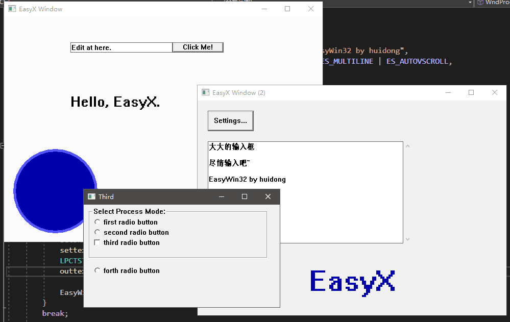
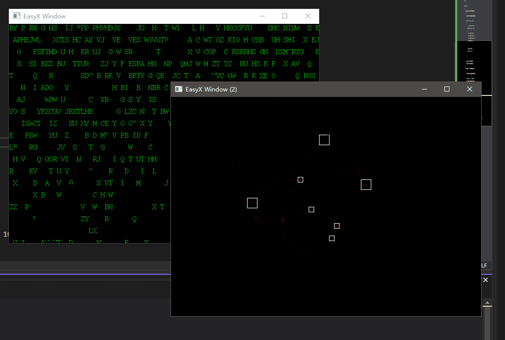

# EasyWin32


[](http://huidong.xyz)
[](https://easyx.cn)

EasyX 库的 Win32 拓展版：解锁多窗口（同时创建多个绘图窗口）、可以使用 Win32 控件、可以拉伸窗口大小

对原生 EasyX 兼容性超强~~ 只需稍稍改动您的代码，就可以在原有项目上应用 EasyWin32。

> [查看教程](./Tutorial.md)

> [更新日志](./Changelog.md)

## 介绍

这个库实现了 EasyX 创建多窗口，以及对 Win32 控件的支持。

这个拓展库的原理是：创建 Win32 窗口，然后将 EasyX 的绘制内容刷新到 Win32 窗口上，以实现在 Win32 应用上进行 EasyX 绘图。

其中使用了我之前写的一个简陋的库 AHGraphics，项目地址：https://github.com/zouhuidong/AHGraphics

但是受限于 EasyX 的绘图机制，也就是每次只能对同一个 IMAGE 对象进行绘制，拖慢了多窗口绘图的效率，不过这也是 EasyX 之 Easy 所在。

各位看官着急试试了吗？那么先上图看看效果吧：





图片对应的示例程序可以在 samples 文件夹中找到，包括源码和可执行程序，源码内附详细注释。

## 编译环境

VisualStudio 2022 | EasyX_20220116 | Windows 10

*您必须已经配置 EasyX 图形库，如未配置，请访问图形库官网 https://easyx.cn

## 配置此库

配置此库很简单，只需要将 lib 文件夹中的所有文件都复制到您的项目目录下，然后添加到您的项目中即可。

在程序中包含头文件 `EasyWin32.h` 来使用此库，并且此库使用了命名空间 `EasyWin32`。

一个最简单的完整示例：
```cpp
#include "EasyWin32.h"
#include <conio.h>

int main()
{
	EasyWin32::initgraph_win32();			// 初始化窗口

	outtextxy(20, 20, L"Hello EasyWin32");	// 绘制文本

	FLUSH_DRAW();							// EasyWin32 默认使用双缓冲绘图，此处输出绘图缓冲

	// 按任意键继续。注意：必须在此判断是否还存在窗口
	while (!_kbhit() && EasyWin32::isAnyWindow())
	{
		Sleep(10);
	}

	EasyWin32::closegraph_win32();			// 关闭窗口
	return 0;
}
```
