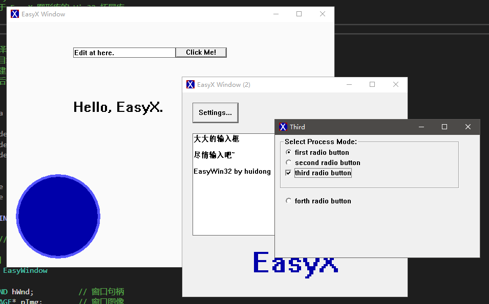
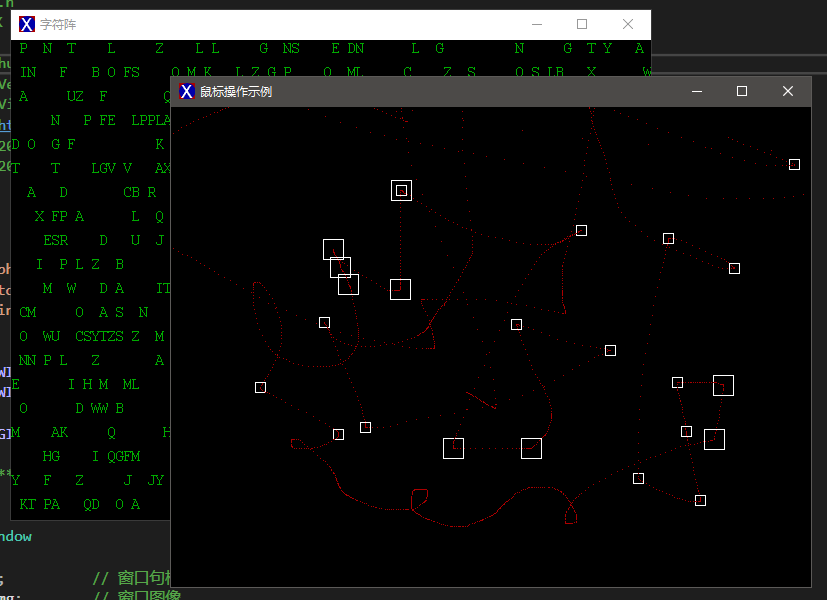
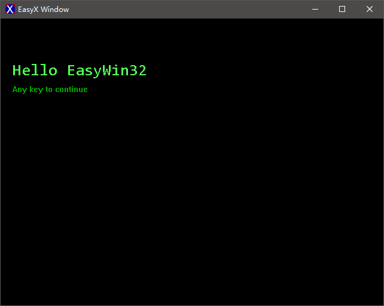

# EasyWin32

[](http://huidong.xyz)
[](https://easyx.cn)


EasyWin32 是基于 EasyX 的 Win32 拓展库，支持多窗口绘图、调整窗口大小、调用 Win32 控件、快速创建托盘等功能 

## 快速入门

EasyWin32 对原生 EasyX 兼容性超强~~ 只需稍稍改动您的代码，就可以在原有项目上应用 EasyWin32。

> [查看教程](./Tutorial.md)

> [更新日志](./Changelog.md)

### 拓展功能

1. 支持多窗口绘图
2. 支持自定义窗口过程函数
3. 支持 Win32 控件
4. 支持窗口大小调整
5. 支持快速创建托盘

### 实现原理

本库创建窗口时完全脱离 EasyX，以获得对窗口的完全控制权。每个窗口对应一块 EasyX 的 IMAGE 画布，绘制内容存储在画布上，显示时再映射到窗口上。

### 编译环境

VisualStudio 2022 | EasyX_20220116 | Windows 10

*您必须已经配置 EasyX 图形库，如未配置，请访问图形库官网 https://easyx.cn*

**注意：暂不支持 MingW 编译器，请使用 VisualStudio 编译项目。**

### 配置此库

配置此库只需要将 lib 文件夹中的所有文件都复制到您的项目目录下，然后添加到您的项目中即可。

调用此库需包含头文件 `EasyWin32.h`，库函数都属于命名空间 `EasyWin32`。

一个很简单的 [完整示例](./samples/Start/main.cpp)：
```cpp
#include "EasyWin32.h"
#include <conio.h>

int main()
{
	EasyWin32::initgraph_win32();			// 初始化窗口

	// 启动一个绘图任务
	// 由于只创建了一个窗口，所以不需要指定目标绘图窗口
	// 否则就需要调用 BEGIN_TASK_WND() 宏，指定目标绘图窗口
	BEGIN_TASK();

	// 绘制文本
	settextstyle(32, 0, L"Consolas");
	settextcolor(LIGHTGREEN);
	outtextxy(20, 70, L"Hello EasyWin32");
	settextstyle(26, 0, L"system");
	settextcolor(GREEN);
	outtextxy(20, 110, L"Any key to continue");

	// EasyWin32 默认使用双缓冲绘图，此处输出绘图缓冲
	// 注意：一段绘图任务结束，必须以此宏结尾（即 BEGIN_TASK 和 END_TASK 必须连用）
	END_TASK();

	// 不在窗口过程函数的 WM_PAINT 消息内绘图时，必须强制重绘
	// 由于没有自定义窗口过程函数，所以当然也要调用此宏强制重绘
	FLUSH_DRAW();

	while (true)
	{
		// 按任意键关闭窗口
		if (_kbhit())
		{
			EasyWin32::closegraph_win32();	// 关闭窗口
			break;
		}

		// 若窗口被关闭，退出程序
		// 注意：这个判断经常被忽略，判断窗口是否还存在是很必要的
		if (!EasyWin32::isAnyWindow())
		{
			break;
		}

		Sleep(10);
	}

	return 0;
}

```

### 示例程序

图片对应的示例程序可以在 ./samples 文件夹中找到，包括源码和可执行程序。







### 绘图效率

EasyWin32 的绘图效率略低于原生 EasyX，但根据测试结果来看，相差并不多。

拖慢 EasyWin32 绘图效率的主要因素是画布和窗口的映射，此外就是多窗口的绘图协调。

关于二者绘图效率的对比程序及其源码，详见 [比较绘图效率](https://github.com/zouhuidong/EasyWin32/tree/main/samples/DrawingEfficiencyComparison)。
