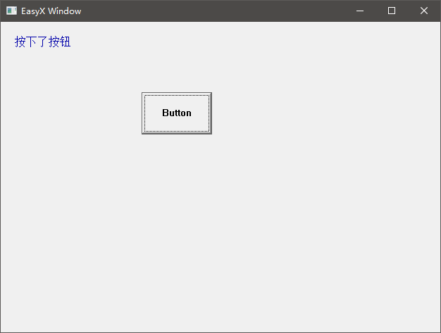

# 开始使用 EasyWin32

EasyWin32 相对 EasyX 的新增函数并不多，易于上手。

确保您在项目中加入了 EasyWin32 的文件，如果还没有，请看 [README.md](./README.md#配置此库)。

注意，并非所有环境都能配置 EasyWin32，推荐使用和我一样的编译环境，否则可能报错，编译环境见 [README.md](./README.md#编译环境)。

由于该库函数并不多，且 EasyWin32.h 中的函数声明都有详细的注释，所以暂时不提供库文档，**请您自行查阅头文件来了解具体的各个函数的功能**。

该库支持您使用顺序代码结构和 Win32 消息派发的代码结构。

> [顺序代码结构的具体例子](./samples/Sample2/main.cpp)

> [Win32 消息派发的代码结构对应的具体例子](./samples/Sample1/main.cpp)

> [二者结合的例子](./samples/Sample3/main.cpp)

而且，EasyWin32 的高兼容性支持您轻松地将原先的 EasyX 项目配置上 EasyWin32。

## 代码结构

### Win32 消息派发式代码结构

如果您希望在程序中使用 Win32 控件，则您需要写一个简化版的 Win32 过程函数，就像下面这样：

```cpp
#include "EasyWin32.h"

// 窗口过程函数
bool WndProc(HWND hwnd, UINT msg, WPARAM wParam, LPARAM lParam, HINSTANCE hInstance)
{
	switch (msg)
	{
	default: return true; break;	// 使用默认方法处理其余消息
	}
	return false;
}

int main()
{
	EasyWin32::initgraph_win32(640, 480, 0, L"", WndProc);	// 创建窗口，并指定窗口过程函数
	EasyWin32::init_end();					// 在 Win32 消息派发的代码结构下，创建完窗口后必须用此函数阻塞
	return 0;
}

```

窗口过程函数的返回值是布尔类型，标识是否需要使用系统默认方法处理该消息。

EasyWin32.h 中注释：
```
//
// 窗口消息处理函数规范
// 
// 函数标准形态：bool WndProc(HWND hwnd, UINT msg, WPARAM wParam, LPARAM lParam, HINSTANCE hInstance);
// 
// 注意：
// 相比于标准的 Win32 窗口过程函数，增加了一个 HINSTANCE 类型形参。
// 返回值的意义也不相同，见下文。
// 
// 返回值：
// true		表示使用系统默认方法处理该消息
// false	表示不再需要系统默认方法处理该消息
// 
// 注意事项：
// 1. 接受 WM_CREATE 消息时，wParam 和 lParam 是空的，你无法获得 CREATESTRUCT 结构体信息
// 2. 接受 WM_CLOSE 消息时，返回 true 或 false 表示是否关闭窗口，但如果关闭窗口，您无需编写销魂窗口的代码
//
```

由于 `main` 函数中调用了 `EasyWin32::init_end()` 函数进行阻塞，这个函数会自动判断窗口是否还存在，所以不需要再使用 `EasyWin32::isAnyWindow()` 进行判断。

然后在 `WndProc` 中创建按钮（可以是其他控件，需要运用 Win32 的知识，这里以按钮举例）：

```cpp
#include "EasyWin32.h"

// 控件 ID
#define IDC_BTN 100

// 窗口过程函数
bool WndProc(HWND hwnd, UINT msg, WPARAM wParam, LPARAM lParam, HINSTANCE hInstance)
{
	switch (msg)
	{
	case WM_CREATE:

		// 创建按钮
		CreateWindow(L"button", L"Button",
			WS_CHILD | WS_VISIBLE | ES_LEFT | WS_BORDER,
			200, 100, 100, 60,
			hwnd, (HMENU)IDC_BTN, hInstance, NULL);

		break;
	default: return true; break;	// 使用默认方法处理其余消息
	}
	return false;
}

int main()
{
	EasyWin32::initgraph_win32(640, 480, 0, L"", WndProc);	// 创建窗口，并指定窗口过程函数
	EasyWin32::init_end();									// 在 Win32 消息派发的代码结构下，创建完窗口后必须用此函数阻塞
	return 0;
}

```

创建按钮完毕，接下来为其添加按键响应：

```cpp
#include "EasyWin32.h"

// 控件 ID
#define IDC_BTN 100

// 存储文本
wchar_t str[128] = { 0 };

// 窗口过程函数
bool WndProc(HWND hwnd, UINT msg, WPARAM wParam, LPARAM lParam, HINSTANCE hInstance)
{
	switch (msg)
	{
	case WM_CREATE:

		// 创建按钮
		CreateWindow(L"button", L"Button",
			WS_CHILD | WS_VISIBLE | ES_LEFT | WS_BORDER,
			200, 100, 100, 60,
			hwnd, (HMENU)IDC_BTN, hInstance, NULL);

		break;

	case WM_PAINT:

		BEGIN_TASK_WND(hwnd);	// 将绘图窗口设为自己，并启动一次绘图任务
		setbkcolor(0xf0f0f0);	// 设置背景色
		settextcolor(BLUE);		// 设置文本色
		cleardevice();			// 清屏
		outtextxy(20, 20, str);	// 输出文字
		END_TASK();				// 结束此次绘图任务

		break;

	case WM_COMMAND:
		switch (LOWORD(wParam))
		{
		case IDC_BTN:	// 按下按钮

			BEGIN_TASK_WND(hwnd);
			wsprintf(str, L"按下了按钮");
			FLUSH_DRAW();		// 在非 WM_PAINT 消息区域，如需要立即刷新，需要强制重绘
			END_TASK();

			break;
		}

	default: return true; break;	// 使用默认方法处理其余消息
	}
	return false;
}

int main()
{
	EasyWin32::initgraph_win32(640, 480, 0, L"", WndProc);	// 创建窗口，并指定窗口过程函数
	EasyWin32::init_end();									// 在 Win32 消息派发的代码结构下，创建完窗口后必须用此函数阻塞
	return 0;
}
```

执行效果：



需要注意的是：每次执行绘图任务（无论是设置绘图属性还是绘图），或者是诸如鼠标消息获取的任务，都需要在每次操作前使用 `BEGIN_TASK()` 或 `BEGIN_TASK_WND(窗口句柄)`，前者无需指定窗口，直接在当前活动窗口上执行任务，但后者需要指定窗口，程序会先将目标绘图窗口转向您设置的窗口，然后再执行任务。

必须在任务执行结束后调用 `END_TASK()`，它和 `BEGIN_TASK()` 配成一对。

EasyWin32 默认就是双缓冲的，所以无需再调用 EasyX 原生的 `BeginBatchDraw` 系列函数。不同于它们的是，`BEGIN_TASK()` 系列宏代表的是一个任务的起始和结束，包括但不限于绘图任务，而 `FLUSH_DRAW()` 则是强制重绘，所以请不要混淆。

还有一点需要注意的是，EasyX 原生的 `BeginBatchDraw` 一系列函数都是面向绘图窗口的，也就是说，如果处在 IMAGE 对象内部，`BeginBatchDraw` 系列函数会出错，但是在 EasyWin32 中我对他们都宏定义了一遍，就算它们被调用了也不会造成影响。

其实，调用 `BEGIN_TASK()` 系列宏来表示一个任务的起始和结束，是为了协调多个窗口同时存在的情况，因为多个窗口可能抢占绘图权，所以您需要在执行一个任务时进行标识，使得多个窗口有序绘图。

如果是在顺序代码结构中，很多时候，用户操作导致的关闭窗口，或者是窗口拉伸导致的画布调整，也很有可能直接掐断您的绘图任务，如果您不使用这些宏来标识您正在进行绘图任务的话，就会导致两个任务互相冲突，导致程序崩溃。

最后提一句，需要具备一些 Win32 编程基础，才能编写 Win32 消息派发式的代码。推荐一个 Win32 学习网站：http://winprog.org/tutorial/zh/start_cn.html 。

### 顺序代码结构

这应该是大家喜闻乐见的写法，因为通常使用 EasyX 的程序都是这样编写的。下面的代码来自 [源码](./samples/Sample2/main.cpp)：
```cpp
////////////////////////////////
//
//	EasyWin32 使用示例
//
//	1. 使用顺序代码结构
//	2. 创建了多个绘图窗口
//	3. 展示了鼠标消息的获取
//

#include "EasyWin32.h"
#include <time.h>

int main()
{
	// 设置随机种子
	srand((unsigned)time(NULL));

	// 创建两个绘图窗口
	HWND hWnd1 = EasyWin32::initgraph_win32(640, 480, false, L"字符阵");
	HWND hWnd2 = EasyWin32::initgraph_win32(640, 480, false, L"鼠标操作示例");

	// 设置窗口 1 绘图样式
	EasyWin32::SetWorkingWindow(hWnd1);
	settextstyle(16, 8, _T("Courier"));
	settextcolor(GREEN);

	// 定时绘制
	clock_t tRecord = 0;

	while (true)
	{
		// 若窗口 1 还存在（未被关闭）
		if (EasyWin32::isAliveWindow(hWnd1))
		{
			// 一段时间重绘一次
			if (clock() - tRecord >= 100)
			{
				// 设置窗口 1 为目标绘图窗口，并启动一个绘图任务
				BEGIN_TASK_WND(hWnd1);

				// 绘制内容：EasyX 官方示例“字符阵”（简化）
				cleardevice();
				for (int i = 0; i <= 200; i++)
				{
					// 在随机位置显示三个随机字母
					for (int j = 0; j < 3; j++)
					{
						int x = (rand() % 80) * 8;
						int y = (rand() % 20) * 24;
						char c = (rand() % 26) + 65;
						outtextxy(x, y, c);
					}
				}

				// EasyWin32 默认使用双缓冲绘图，此处输出绘图缓冲
				// 注意：一段绘图任务结束，必须以此宏结尾（即 BEGIN_TASK_WND 和 END_TASK 必须连用）
				END_TASK();

				// 不在窗口过程函数的 WM_PAINT 消息内绘图时，必须强制重绘
				// 由于没有自定义窗口过程函数，所以当然也要调用此宏强制重绘
				FLUSH_DRAW();
			}
		}

		// 窗口 2
		if (EasyWin32::isAliveWindow(hWnd2))
		{
			BEGIN_TASK_WND(hWnd2);

			// 绘制内容：EasyX 官方示例“鼠标操作”（有改动）
			ExMessage m;
			while (peekmessage(&m, EM_MOUSE))
			{
				switch (m.message)
				{
				case WM_MOUSEMOVE:
					// 鼠标移动的时候画红色的小点
					putpixel(m.x, m.y, RED);
					break;

				case WM_LBUTTONDOWN:
					// 如果点左键的同时按下了 Ctrl 键
					if (m.ctrl)
						// 画一个大方块
						rectangle(m.x - 10, m.y - 10, m.x + 10, m.y + 10);
					else
						// 画一个小方块
						rectangle(m.x - 5, m.y - 5, m.x + 5, m.y + 5);
					break;
				}
			}

			END_TASK();
			FLUSH_DRAW();
		}

		// 若所有窗口都被关闭，则结束程序
		if (!EasyWin32::isAnyWindow())
		{
			break;
		}

		// 降低 CPU 占用
		Sleep(50);
	}

	return 0;
}

```

代码其实很简单，注释也很详细，这种“顺序代码结构”与上面那种 Win32 式的代码结构最大的区别就是不需要创建 `WndProc`，即窗口过程函数。

接下来我为大家剖析这段代码。

**判断窗口存在**

首先，由于创建了两个窗口，那么在主循环的绘图中，您需要分两个 `if` 语句分别判断窗口是否还存在，因为窗口可能被用户关闭。若窗口还存在，才继续绘图。

---

**设置绘图窗口、输出绘图缓冲**

在 `if` 语句内部，执行绘图任务时，需要调用 `BEGIN_TASK`（或 `BEGIN_TASK_WND`） 宏，任务结束时，使用 `END_TASK()` 宏。由于这部分内容在上一节中讲过，所以不再赘述。

不同与 Win32 消息派发式的代码结构，顺序代码结构中，由于没有创建窗口过程函数，所以没有在正常的 WM_PAINT 消息中绘图，这就需要在每次绘图任务结束时，再调用 `FLUSH_DRAW()` 宏，以强制重绘。

---

**鼠标消息、键盘消息**

鼠标消息兼容旧版 MOUSEMSG，同时支持 ExMessage（ExMessage 系列函数暂时只能获取 EM_MOUSE 消息，即鼠标消息）。

按键消息支持直接使用 `_getch` 一系列函数获取。

注意：使用鼠标消息相关函数时，同样也需要使用 `BEGIN_TASK` 系列宏来标识进行一个任务。

---

**容易忽略的程序结束判定**

在程序主循环的末尾，调用了 `EasyWin32::isAnyWindow()` 判断了是否还存在已经被创建的窗口，如果所有窗口都被关闭，则跳出循环并关闭程序。

这条判断很容易被忽略，如果不对是否还存在窗口进行判断的话，所有窗口都被关闭后，`main` 函数仍会继续运行，但是不在 Windows 任务栏中显示，会残留在后台进程中。

如果在 Win32 消息派发式的代码中，您可以使用阻塞函数 `EasyWin32::init_end()`，这个前面也提到过。

如果您不喜欢以上方式，事实上您可以在创建窗口完毕之后，调用一次 `EasyWin32::AutoExit();`，这个函数将自动检测是否还有任何窗口未被关闭，如果全部窗口都被关闭，则自动结束程序。

### 混合式

如果前面两种代码结构混合起来也是可以的，见 [Sample3](./samples/Sample3/main.cpp)。

使用混合式的代码可以在顺序执行代码的同时，帮助您处理一些 Windows 消息，例如在 Sample3 中就响应了 WM_CLOSE 消息，也就是在用户点击关闭窗口的时候，弹出了一个提示框。

## 关于 IMAGE* 的空指针

由于 EasyWin32 绕开了 EasyX 原生的 `initgraph` 函数，所以在调用需要 `IMAGE` 对象指针的函数时，不可以传入 `NULL`，而需要传入您的窗口的 `IMAGE` 对象指针。

诸如以下函数都默认会传入 `IMAGE* pImg = NULL`：`GetImageBuffer`，`SetWorkingImage`，`GetImageHDC` 等等，都需要传入具体的指针。

## 程序图标

EasyWin32 将自绘一个 EasyX 的图标作为程序图标，这个图标模仿的是 EasyX 官网的页面图标。

如果想要使用自己的图标，必须先在程序第一次创建窗口前就设置 `EasyWin32::SetIsUseCustomAppIcon(true);`。

## 在原有 EasyX 项目上使用 EasyWin32

在大多数情况下，在原有 EasyX 项目上使用 EasyWin32 是很轻松的。

首先将 `#include <graphics.h>` 或 `#include <easyx.h>` 替换为 `#include "EasyWin32.h"`。

如果您的代码使用了批量绘图，那么在使用了批量绘图的地方必然存在 `FlushBatchDrawing()` 函数，比如下面这段代码：

```cpp
while(true)
{
	for (int i = 0; i < 10 ; i++)
	{
		line(10, i*10, 110, i*10);
	}
	Sleep(20);
	outtextxy(0, 0, L"Hello");
	FlushBatchDraw();

	cleardevice();
}
```

那么，在绘图开始的地方加上 `BEGIN_TASK();`，然后在绘图结束的地方，也就是 `FlushBatchDraw()` 的前面，加上 `END_TASK();`，如下：

```cpp
while(true)
{
	BEGIN_TASK();	//<- add

	for (int i = 0; i < 10 ; i++)
	{
		line(10, i*10, 110, i*10);
	}
	Sleep(20);
	outtextxy(0, 0, L"Hello");

	END_TASK();	//<- add
	FlushBatchDraw();

	cleardevice();
}
```

这还没完，您必须确保任何的绘图操作都被放到了 `BEGIN_TASK();` 和 `END_TASK();` 的中间，就像下面这样：

```cpp
while(true)
{
	BEGIN_TASK();

	cleardevice();	//<- Move here
	for (int i = 0; i < 10 ; i++)
	{
		line(10, i*10, 110, i*10);
	}
	Sleep(20);
	outtextxy(0, 0, L"Hello");

	END_TASK();
	FlushBatchDraw();
}
```

而原先代码中的 `FlushBatchDraw()` 函数是不需要改的，因为会被宏自动替换为 `FLUSH_DRAW()`，`EndBatchDraw()` 同样也被替换为 `FLUSH_DRAW()`，至于 `BeginBatchDraw()`，他会被替换为空。

所以按理来说您不需要删除任何代码，只需要在每个 `FlushBatchDraw()` 函数前，把整个绘图任务用 `BEGIN_TASK();` 和 `END_TASK();` 包起来即可。

但是还有比较细节的一点，如果说 `Sleep()` 的调用只是为了降低 CPU 占用，则不要将其放在一个绘图任务中，而应该挪到外面来，如下：

```cpp
while(true)
{
	BEGIN_TASK();

	cleardevice();
	for (int i = 0; i < 10 ; i++)
	{
		line(10, i*10, 110, i*10);
	}
	outtextxy(0, 0, L"Hello");

	END_TASK();
	FlushBatchDraw();
	
	Sleep(20);	//<- Move here
}
```

这很关键，因为如果不把 `Sleep()` 放出来，那么这个循环就会变得非常紧密，在 `END_TASK();` 刚结束不久，马上就会 `BEGIN_TASK();`，相当于程序几乎毫无空隙地占用了绘图权，这可能会导致用户操作（例如拉伸窗口）需要等待很久才能做出反应，因为 EasyWin32 必须等待程序没有占用绘图权的时候才能处理这些消息（例如拉伸窗口引发的画布大小调整）。

所以在多次绘图任务的间隙中插入 `Sleep()` 很必要，同时也能降低 CPU 占用，但是不要把 `Sleep()` 放在绘图任务中进行。如果必须要这么做，可以在 `Sleep()` 前后断开这个任务，将其一分为二，如下：

```cpp
while(true)
{
	BEGIN_TASK();

	cleardevice();
	for (int i = 0; i < 10 ; i++)
	{
		line(10, i*10, 110, i*10);
	}
	
	END_TASK();	//<- interrupt the task
	FlushBatchDraw();
	
	Sleep(3000);	//<- sleep
	
	BEGIN_TASK();	//<- start the task again
	
	outtextxy(0, 0, L"Hello");

	END_TASK();
	FlushBatchDraw();
}
```

当然，如果您的原代码中没有使用 `FlushBatchDraw();`，可能就需要麻烦一点：得一个个地把 `BEGIN_TASK();` 系列的宏加入到每个单个的绘图任务中。

最后，如果您使用了 `initgraph()` 函数来创建窗口，那么您就不再需要检测窗口的关闭，因为它自动设置了 `EasyWin32::AutoExit();`。否则的话，您就必须检测窗口是否关闭，然后退出程序。

## 自定义窗口样式

如果您想改变窗口样式，例如取消最大化按钮，禁止用户拉伸窗口，您可以使用 Win32 API `SetWindowLong` 函数，这需要一些 Win32 知识。

`SetWindowLong` 函数不仅仅能够设置窗口的样式，还可以做很多其他事情，但是设置窗口样式是比较常用的功能，所以 EasyWin32 将其做了简单封装。就设置窗口样式而言，您可以调用 `EasyWin32::GetWindowStyle()` 获取当前窗口样式，调用 `EasyWin32::SetWindowStyle()` 设置当前窗口样式。

但是如果您只是想取消（或启用）最大化按钮，并禁止（或允许）用户拉伸窗口，最简单的方式是使用 EasyWin32 定义的宏 `DisableResizing()`，传入布尔型参数，表示是否禁用当前窗口调整大小。


